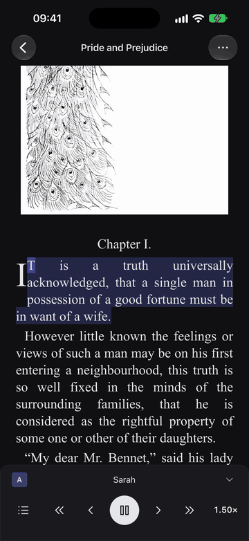

<h1 align="center">OpenReader</h1>

<em>Text-to-speech for EPUB on iPhone: the speech service you choose, every word highlighted as it is spoken.</em>

  
  
  
  

If you like OpenReader, give it a ⭐ on <a href="https://github.com/xujialiu/OpenReader">GitHub</a> — it helps others find it.

## What it does

OpenReader is an iPhone app that reads EPUB documents aloud with the speech service you choose, using your own account with that service.

- 🗣️ **The voice you choose**: Fish Audio, Azure, Speechify, OpenAI, any OpenAI-compatible server, or a Kokoro-FastAPI server of your own.
- ✨ **Every word highlighted as it is spoken**, over its sentence, in your own colours.
- 📥 **Offline narration**: save a book's audio chapter by chapter, then listen without a connection.
- 🔄 **Sync with [Zotero-OpenReader](https://github.com/xujialiu/Zotero-OpenReader)**: your reading position moves between the phone and Zotero on your computer, through your own WebDAV folder.
- 📖 **Word Lookup and translation**: long-press a word for its meanings, or translate a passage.
- 🎨 **Themes, fonts, font size, margins and text alignment.**
- 🎧 **Lock Screen and Dynamic Island** controls while it reads.
- 🔒 **No account, no server of its own, no analytics.** Text goes to a service only after you allow it.

## Install

1. On an iPhone with iOS 17.2 or later, open the [TestFlight link](https://testflight.apple.com/join/vjC8QejW), install Apple's TestFlight app, then install OpenReader from it.
2. In OpenReader, open **Settings → Providers**, choose a service, paste your API key and turn **Enabled** on.
3. Add an EPUB with **⋯ → Import file** in the Library, or share one to OpenReader from Files. Open it and press **Play**.

## Support

- Support: https://xujialiu.github.io/OpenReader/
- Privacy policy: https://xujialiu.github.io/OpenReader/privacy.html
- Author: Xujia Liu · xujialiuphd@gmail.com

Its desktop counterpart is [Zotero-OpenReader](https://github.com/xujialiu/Zotero-OpenReader), a plugin for Zotero. The two carry a reading position between them through the owner's own WebDAV storage.

## Building

OpenReader is an Expo SDK 57 app with native modules of its own, so it runs as a development build rather than in Expo Go. [docs/install-on-simulator.md](docs/install-on-simulator.md) and [docs/install-on-iphone.md](docs/install-on-iphone.md) describe both builds.

## Licence

Copyright (C) 2026 Xujia Liu.

OpenReader is free software: you can redistribute it and/or modify it under the terms of the GNU Affero General Public License, version 3, as published by the Free Software Foundation. See [LICENSE](LICENSE).
